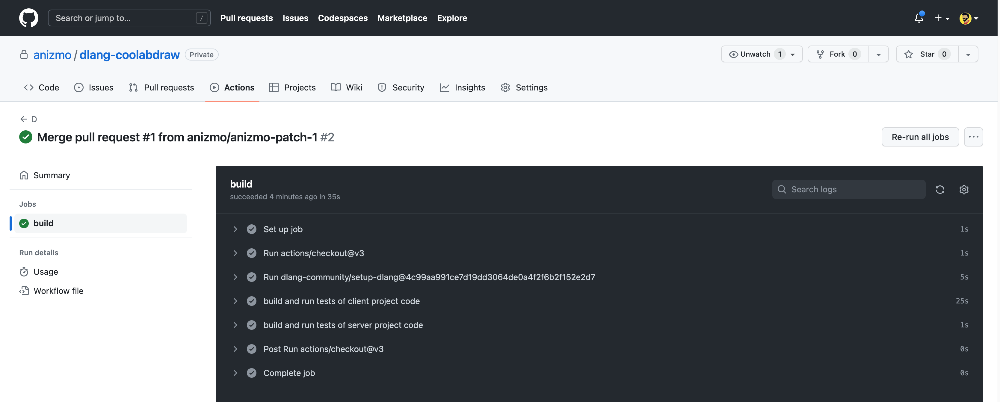

# Collaborative Paint App - Team DLang Mafia
Collaborative Paint app is a multi-client application that allows multiple users to connect to a drawing canvas
and paint simulataneously. Clients can additional chat with each other

## Requirements
- dub
- Gtkd
- unit-threaded

# Building Software

- [✓] Instructions on how to build your software should be written in this file
    - This is especially important if you have added additional dependencies.
    - Assume someone who has not taken this class (i.e. you on the first day) would have read, build, and run your software from scratch.
- You should have at a minimum in your project
    - [✓] A dub.json in a root directory
        - [✓] This should generate a 'release' version of your software
    - [✓] Run your code with the latest version of d-scanner before commiting your code (could be a github action)
    - [✓] (Optional) Run your code with the latest version of clang-tidy  (could be a github action)

*Modify this file to include instructions on how to build and run your software. Specify which platform you are running on. Running your software involves launching a server and connecting at least 2 clients to the server.*

# Running our Project

## Installation and Repository Setup
1. Installation depends on the setup of your development environment. We have built the app using **macOS**.
2. Install D lang compiler on your machine. Download the latest version of D compiler from https://www.dlang.org. If you have windows PC, we prefer using DMD compiler, else if you have Mac/Linux use LDC compiler. If you are on Mac, it is preferable to use homebrew to install LDC.
3. Clone our repository in the root directory. We have the drawing app implemented in SDL as well as GTK + cairo. Since SDL + gtk does not work with Mac, we decided to switch our implementation from SDL to gtk + cairo, the code for which is inside FinalProject folder.

## How to run the app
Inside the FinalProject folder, there are 2 folders - draw_server and draw_client. Both are dub projects.
As the name suggests, "draw_server" contains the server code and "draw_client" consists of the client code.

-	Input the IP address and the port the client attempts to connect to.(Say, localhost and 50002)

You can see a canvas come up and use the features of the canvas. You can run multiple clients similarly.
Please look at the Milestone-10 video link to better understand the app features.

## Running Server.
1. The following are the steps to run the server.
    -	Go inside "draw_server" folder and run "dub run --build=release".
    ```
    cd FinalProject/draw_server
    dub run --build=release
    ```
    -	Input the IP address and the port the server runs on.(Say, localhost and 50002)
2. First it will prompt the user to enter ip address and port number on which the server should run.
    ```
    Enter IP Address: localhost 
    Enter port: 50002
    ``` 
3. After running the above command, the server starts and waits for a client

## Running Clients
1. In a new terminal window (say **Terminal 2**) run the command
    - Go inside "draw_client" folder and run "dub run --build=release".
       ```
       cd FinalProject/draw_client
       dub run --build=release
       ```
2. It will prompt you for IP address and port number of the server. Enter them IP and port on which your server is running.
   ```
   Enter IP address: localhost
   Enter port: 50002
   ```
   You can see a paint window open.
2. In order to connect multiple clients and open multiple paint windows. Repeat the Running Client shown above in
   different terminals.

## Four Clients collaborating simultaneously - Demo


## Features
You can interact with this application to use our features as follows.

### Color Picker
* By clicking on the "color" option in the menu bar, you can access a palette that allows you to choose from a range of colors for your brush.
* Unlike the limited selection of just three colors, this palette offers various shades and hues to choose from. It's important to note that the color you choose for your brush on your client will not affect the color of the brush on other clients.
* When you use this newly selected color to draw, the changes will be reflected in real-time on all connected clients.

## Chat
* Clients can chat among each other through the GUI and send messages among each other.
* If a client joins in the middle of a session, they still get the whole history.

### Brush Size
* You can also change brush size by clicking on `BrushSize`.
* Select 1, 2, 3, and 4, where 1 is the smallest brush and 4 is the largest brush.

### Undo/ Redo
* You can undo your previous actions and also redo any undone actions by pressing the undo and redo buttons on the GUI.
* Undo/ Redo history will be preserved for all the clients. Any new clients joining can undo/ redo actions done by previous clients.

### Terminating the application
To terminate the application, visit each of the client and server terminal and press `ctrl + c`

## Testing
We have also written unit test cases to check the validity of our code. You can run the unit test features by simply running the below command.
```
dub test
```

## Continuous Integration and Documentation
- You can find the documentation for the code in the /docs folder inside both the client and the server projects.
- Continuous Integration is set on GitHub and has been tested on own account. Each time a pull request is done on the master branch or any branch is merged to the master all the tests are run on GitHub.
- A screenshot of the GitHub actions running is shown below:



## Future Scope
-	Include the logic for erasing the canvas strokes.
-	Ability to add multiple shapes.

